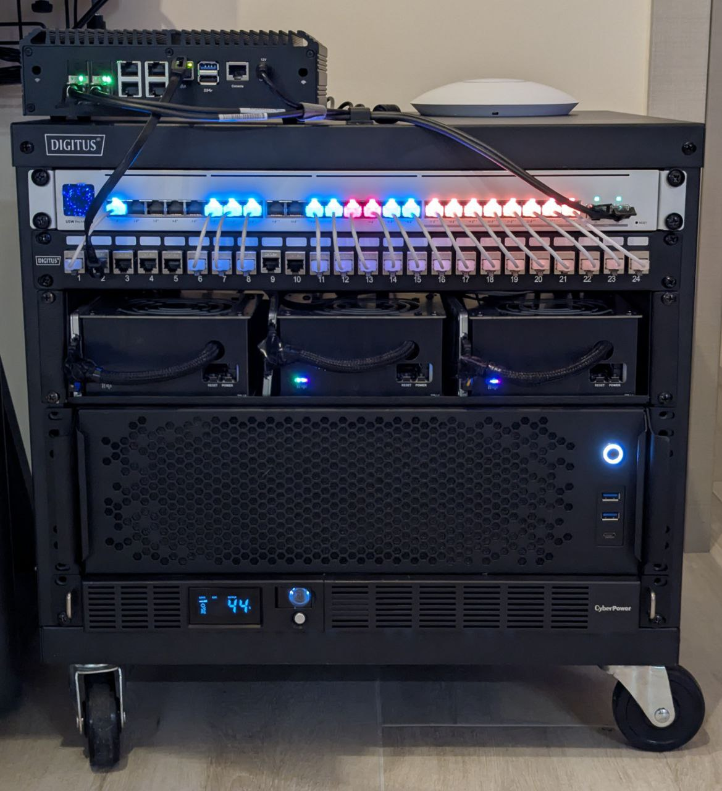

## Hi there 👋

DevOps / Platform Engineer interested in bare-metal, networking, and self-hosting.

Currently working at [**Cloudless Labs**](https://cloudless.dev), building the [IaaS/PaaS cloud](https://github.com/fluencelabs) based on K8S.

## Projects

I have server racks at home.

### [HomeLab Gen 2](https://github.com/nahsilabs)

Self-hosted infrastructure for personal use and experimentation with distributed systems, storage, and container orchestration platforms.

Based on Proxmox + Talos.

### [HomeLab Gen 1](https://github.com/nahsi-homelab) - deprecated

Self-hosted infrastructure for personal use and experimentation with distributed systems, storage, and container orchestration platforms.

Based on Gentoo + HashiStack.
